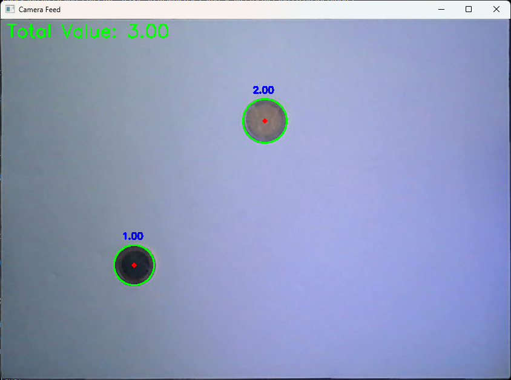
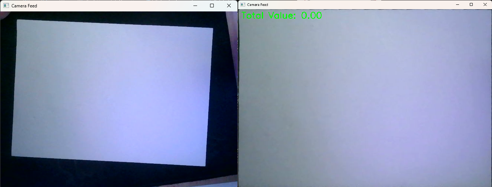
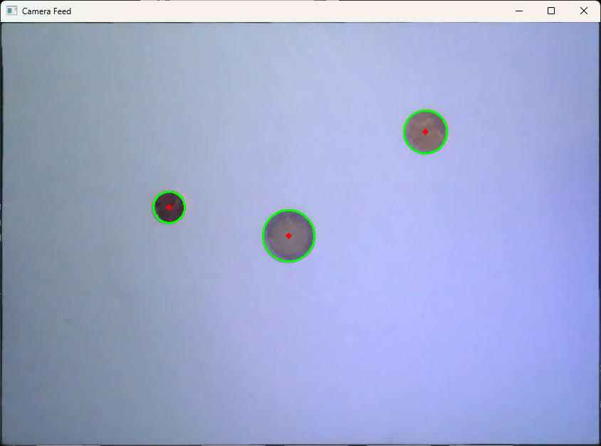
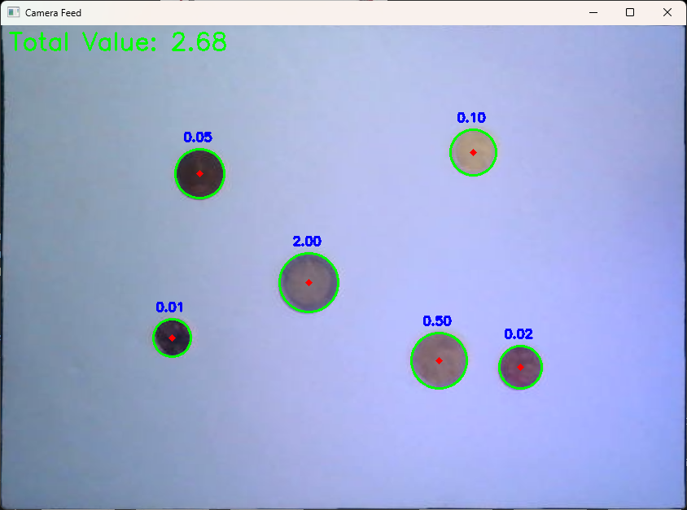
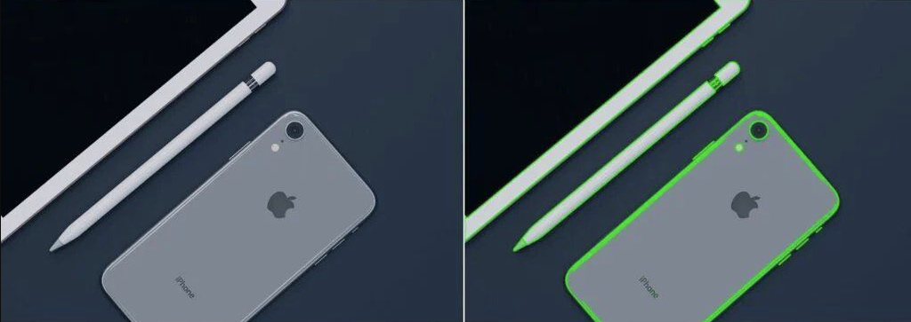
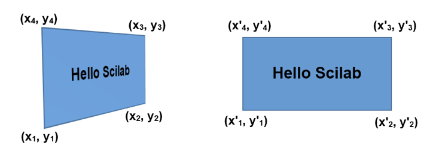
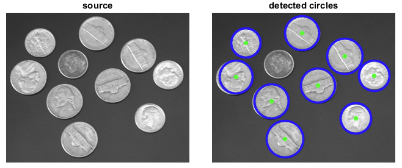
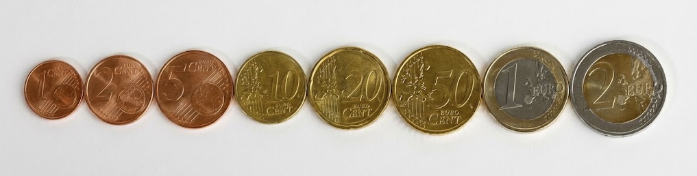

# PaperCoin

##### Antonios Papageorgiou Tsakanikas - 220118
A computer vision application that automatically detects and counts Euro coins placed on an A4 paper using real-time camera feed. The system identifies coin denominations based on their size and calculates the total monetary value.

## Overview

This project uses OpenCV and Python to create a robust coin counting system that can handle various lighting conditions and camera angles. By using an A4 paper as a reference surface, the system provides consistent detection regardless of camera positioning.

---

## Core Functions

### 1. `find_and_crop_a4(frame)`
**Purpose:** Establishes a stable reference frame for coin detection.

This function locates an A4 paper in the camera view and performs perspective correction to create a flat, overhead view. The A4 paper serves as both a reference surface and a potential calibration target (though calibration is not yet fully implemented).

**Key Operations:**
- Converts frame to grayscale and applies Gaussian blur
- Uses Canny edge detection to find contours
- Identifies quadrilateral shapes with aspect ratio ~1.414 (√2, the A4 ratio)
- Applies perspective transform to "flatten" the paper
- Implements temporal smoothing to prevent jittery detection
- Automatically detects orientation (portrait vs. landscape)

### 2. `hough_circle_detection(coins, min_r, max_r)`
**Purpose:** Detects circular shapes (coins) in the processed image.

This is the heart of the coin detection system, using OpenCV's Hough Circle Transform to identify circular objects within specified radius ranges.

**Key Operations:**
- Converts to grayscale and applies median blur
- Runs Hough Circle Transform with tuned parameters
- Returns detected circles with center coordinates (x, y) and radius (r)

### 3. `find_coins(frame)`
**Purpose:** Identifies, tracks, and values each coin in the frame.

This function combines detection with intelligent tracking and filtering to provide stable, accurate coin counting.

**Key Operations:**
- Calls `hough_circle_detection()` to find potential coins
- **Coin Tracking:** Matches detected coins across frames using position-based IDs
- **Radius Filtering:** Maintains a 30-frame history of each coin's radius and uses the mean to reduce noise
- **Value Assignment:** Maps filtered radius to Euro denominations using the `COIN_VALUES` dictionary
- **Visual Output:** Draws circles and labels on each detected coin
- **Cleanup:** Removes coins from history when no longer detected

---

## Methodologies

### 1. **Contour Detection & Polygon Approximation**
The A4 paper detection relies on finding the largest quadrilateral contour that matches the expected aspect ratio. This is achieved through:
- **Canny Edge Detection:** Identifies edges in the image
- **`findContours()`:** Extracts boundary shapes
- **`approxPolyDP()`:** Simplifies contours into polygons
- **Aspect Ratio Filtering:** Ensures the detected shape matches A4 proportions

### 2. **Perspective Transform**
Once the four corners of the A4 paper are identified, a perspective transformation creates a "bird's eye view" of the surface. This involves:
- **Corner Ordering:** Sorting points using sum and difference operations to consistently identify top-left, top-right, bottom-right, and bottom-left
- **`getPerspectiveTransform()`:** Calculates the transformation matrix
- **`warpPerspective()`:** Applies the transformation to create a flat, rectangular view

### 3. **Hough Circle Transform**
The Hough Circle Transform is a feature extraction technique specifically designed to detect circles in images. It works by:
- Detecting edge pixels (using Canny internally)
- For each edge pixel, considering all possible circles that could pass through it
- Accumulating "votes" in parameter space (center x, center y, radius)
- Identifying peaks in this accumulator as detected circles

This method is robust to incomplete circles and noise, making it ideal for coin detection.

### 4. **Temporal Smoothing & Filtering**
To prevent flickering and unstable detections, the system implements several smoothing techniques:

**A4 Paper Smoothing:**
- Tracks corner positions across frames
- Only updates position if movement exceeds a threshold
- Keeps previous position for small movements to reduce jitter

**Coin Radius Filtering:**
- Maintains a 30-frame rolling history of each coin's detected radius
- Uses the mean radius value for classification
- Reduces noise from slight detection variations

**Coin Tracking:**
- Assigns unique IDs to coins based on position
- Tracks coins across frames by matching nearest positions
- Preserves radius history even when coins move slightly

### 5. **Radius-Based Classification**
Euro coins have standardized diameters, so coins can be identified by measuring their size. The system:
- Detects coin radius in pixels
- Maps radius ranges to specific Euro denominations
- Uses averaged radius values for more accurate classification

---

### Resources

#### Hough Circle Transform
- **[Circle Detection using OpenCV - PyImageSearch](https://pyimagesearch.com/2014/07/21/detecting-circles-images-using-opencv-hough-circles/)** - Tutorial on Hough Circle detection
- **[Hough Circle Transform Explained - YouTube](https://youtu.be/Ltqt24SQQoI?si=k0XURJLQOSclCEjU)** - Visual explanation of how the algorithm works
- **[OpenCV Documentation - Hough Circle Transform](https://docs.opencv.org/4.x/dd/d1a/group__imgproc__feature.html#ga47849c3be0d0406ad3ca45db65a25d2d)** - Official documentation

#### Perspective Transform
- **[Warp Perspective with OpenCV | Document Scanner](https://www.youtube.com/watch?v=SQ3D1tlCtNg&t=200s)** - Four-point perspective transform tutorial
- **[Perspective Transformation - PyImageSearch](https://pyimagesearch.com/2014/08/25/4-point-opencv-getperspective-transform-example/)** - Practical application of perspective transforms

#### Coin Detection Specific
- **[Coin Detection using Python OpenCV - GeeksforGeeks](https://www.geeksforgeeks.org/cpp/opencv-c-program-for-coin-detection/)** - Specific coin detection examples
- **[Object Detection with OpenCV and Python - YouTube](https://youtu.be/RFqvTmEFtOE?si=5XC3YeTBaQGOvBZ4)** - General object detection techniques

#### AI & Communities
- **[Claude Sonnet 4.5](https://claude.ai/)** - AI assistant for code help and problem-solving
- **[Stack Overflow - OpenCV Tag](https://stackoverflow.com/)** - Community Q&A for specific issues
- **[r/opencv - Reddit](https://www.reddit.com/)** - OpenCV community discussions